# StreamBox

Modern bir **Netflix benzeri film platformu** olarak geliştirilen StreamBox projesi, **ASP.NET Core MVC + ASP.NET Core Web API** mimarisi kullanılarak hazırlanmıştır.

Projede MVC katmanı doğrudan veritabanına bağlanmamaktadır. Tüm veri alışverişi **RESTful Web API** üzerinden gerçekleştirilmektedir. Böylece katmanlı mimari korunmuş, sürdürülebilir ve profesyonel bir yapı oluşturulmuştur.

---

# Kullanılan Teknolojiler

- ASP.NET Core MVC (.NET 10)
- ASP.NET Core Web API (.NET 10)
- Dapper
- SQL Server LocalDB
- RESTful API
- HttpClient
- Bootstrap 5
- HTML5
- CSS3
- JavaScript
- Newtonsoft.Json
- ClosedXML
- QuestPDF

---

# Proje Mimarisi

## StreamBox API

API katmanı;

- RESTful API
- Dapper ORM
- Repository Pattern
- SQL Server
- CRUD İşlemleri
- JOIN Sorguları
- GROUP BY Raporları

içermektedir.

---

## StreamBox MVC

MVC katmanı;

- HttpClient ile API haberleşmesi
- Modern kullanıcı arayüzü
- Login / Register
- Session Authentication
- Admin Paneli
- PDF Export
- Excel Export

özelliklerine sahiptir.

---

# Veritabanı

Projede aşağıdaki ilişkili tablolar bulunmaktadır.

- Movies
- Categories
- Actors
- MovieActors

## Veritabanı İlişkileri

| Tablo | İlişki |
|--------|---------|
| Categories | **1 → N** Movies |
| Movies | **N → N** Actors |
| MovieActors | Movies ile Actors arasında ilişki kuran ara (Junction) tablodur. |

---

# Kullanıcı Yetkilendirme

## Admin

- Film Yönetimi
- Kategori Yönetimi
- Oyuncu Yönetimi
- Film Oyuncuları Yönetimi
- Raporlar
- PDF Export
- Excel Export

## User

- Film Listeleme
- Film Detay Sayfası
- Giriş Yap
- Kayıt Ol

---

# Raporlar

Projede toplam **10 adet rapor** bulunmaktadır.

- Toplam Film
- Toplam Kategori
- Toplam Oyuncu
- Film Oyuncu Sayısı
- En Eski Film
- En Yeni Film
- Kategoriye Göre Film Sayıları
- Ülkeye Göre Oyuncu Sayıları
- Film Kategori Listesi
- Film Oyuncu Listesi

---

# Proje Görselleri

## Ana Sayfa

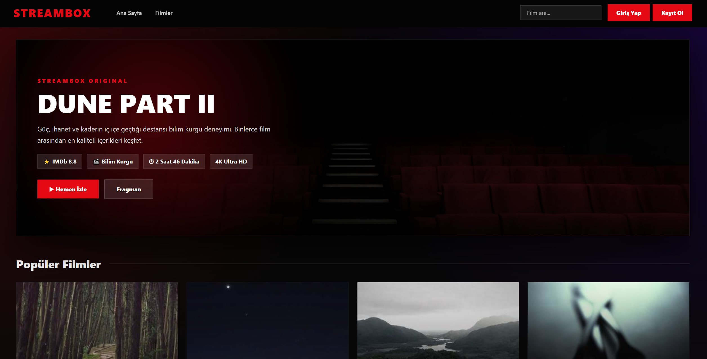

---

## Film Detay Sayfası

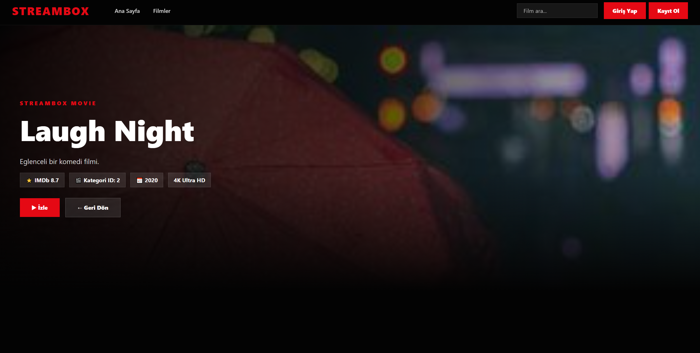

---

## Login

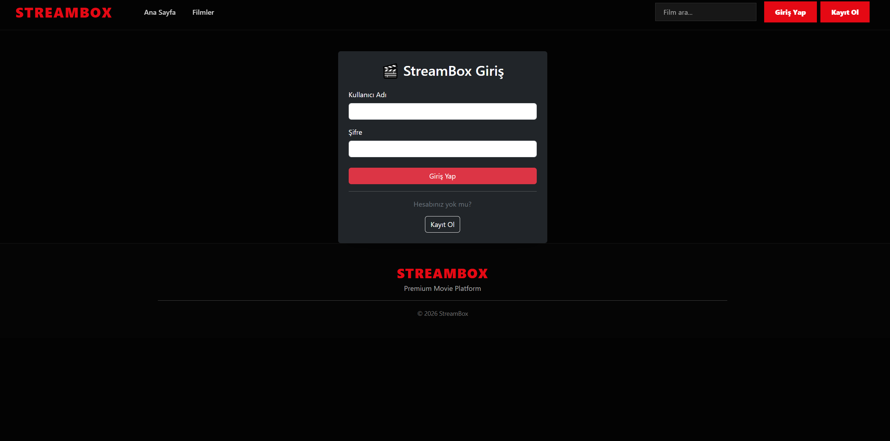

---

## Register

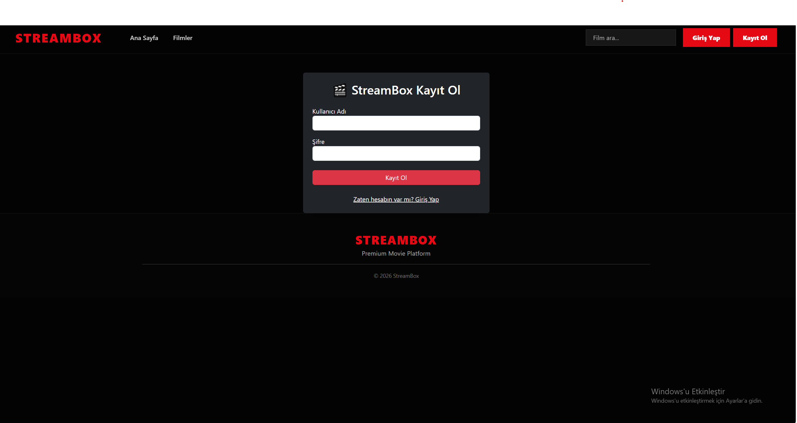

---

## Admin Dashboard

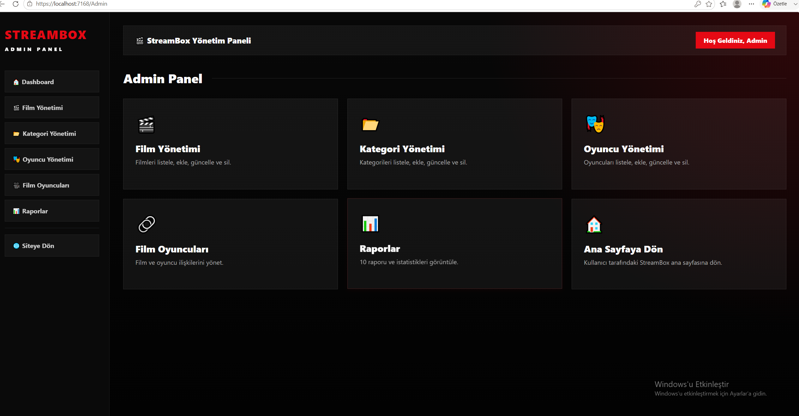

---

## Film Yönetimi

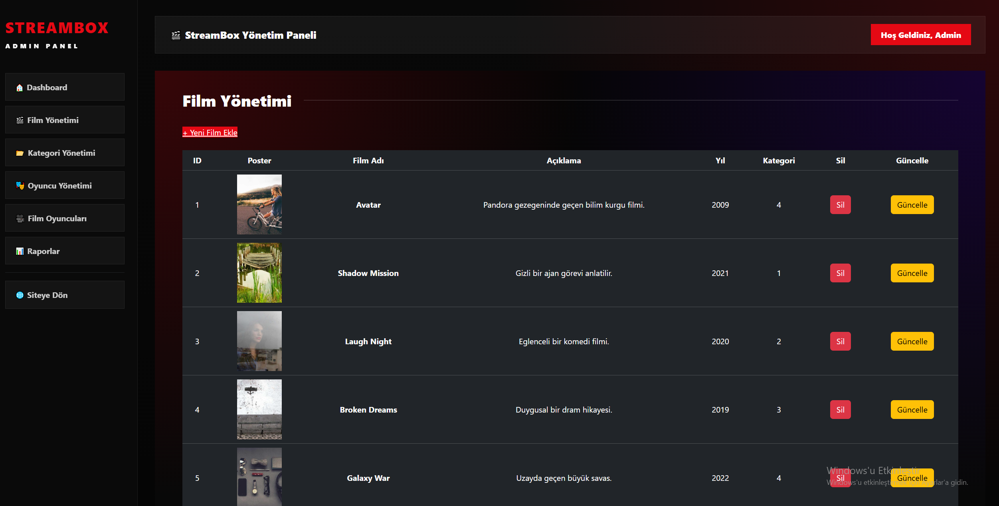

---

## Kategori Yönetimi

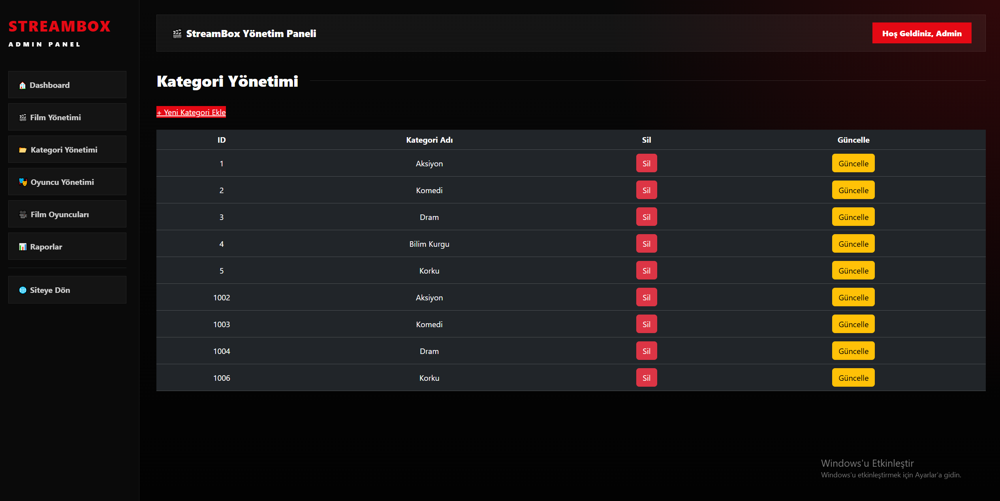

---

## Oyuncu Yönetimi

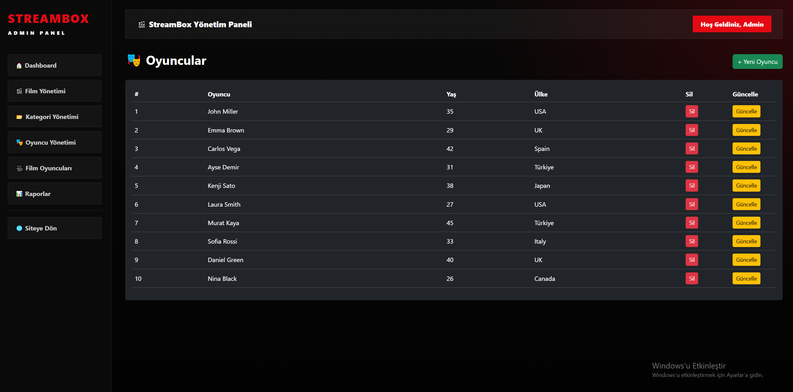

---

## Film Oyuncuları Yönetimi

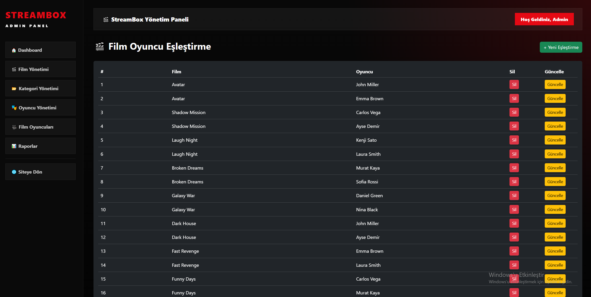

---

## Raporlar

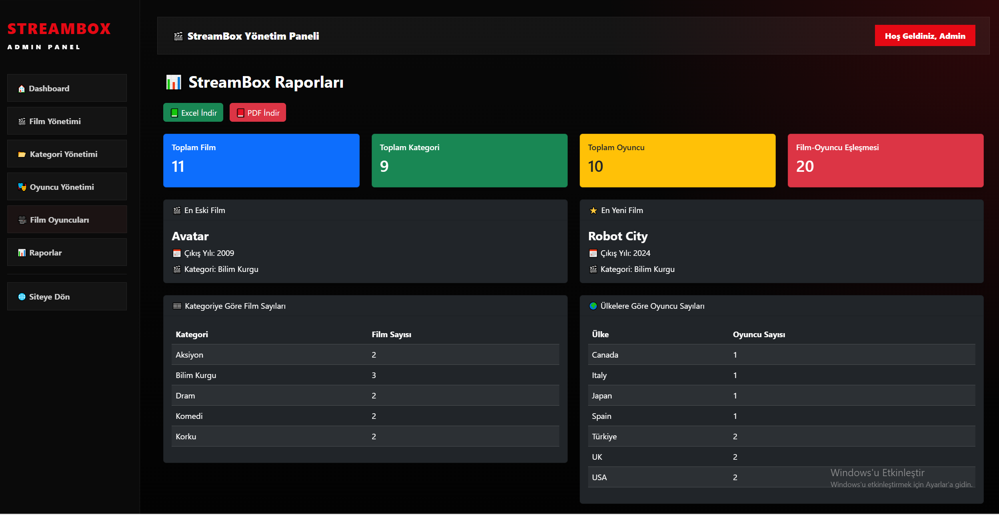

---

## PDF Export

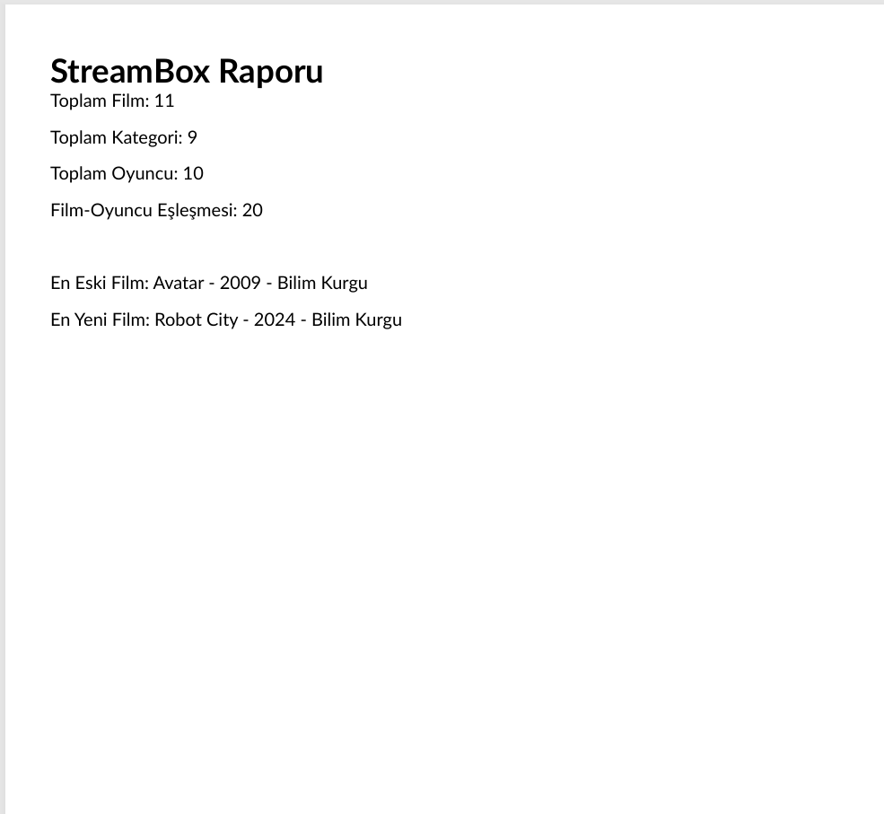

---

## Excel Export

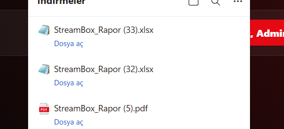

---

# API Endpoints

## Movies

- GET
- POST
- PUT
- DELETE

## Categories

- GET
- POST
- PUT
- DELETE

## Actors

- GET
- POST
- PUT
- DELETE

## MovieActors

- GET
- POST
- PUT
- DELETE

## Reports

- MovieCount
- CategoryCount
- ActorCount
- MovieCountByCategory
- ActorCountByCountry
- MovieCategoryList
- MovieActorList
- OldestMovie
- NewestMovie
- MovieActorCount

---

# Projede Kazandığım Deneyimler

Bu proje sayesinde aşağıdaki teknolojileri uygulama fırsatı buldum.

- ASP.NET Core MVC
- ASP.NET Core Web API
- Dapper
- Repository Pattern
- Katmanlı Mimari
- RESTful API
- SQL Server
- HttpClient
- CRUD İşlemleri
- JOIN
- GROUP BY
- Session Authentication
- Admin Paneli
- PDF Raporlama
- Excel Raporlama
- Responsive Tasarım

---

# Geliştirici

**Başak Erdoğan**

Backend Developer

ASP.NET Core • ASP.NET Core Web API • Dapper • SQL Server • MVC
